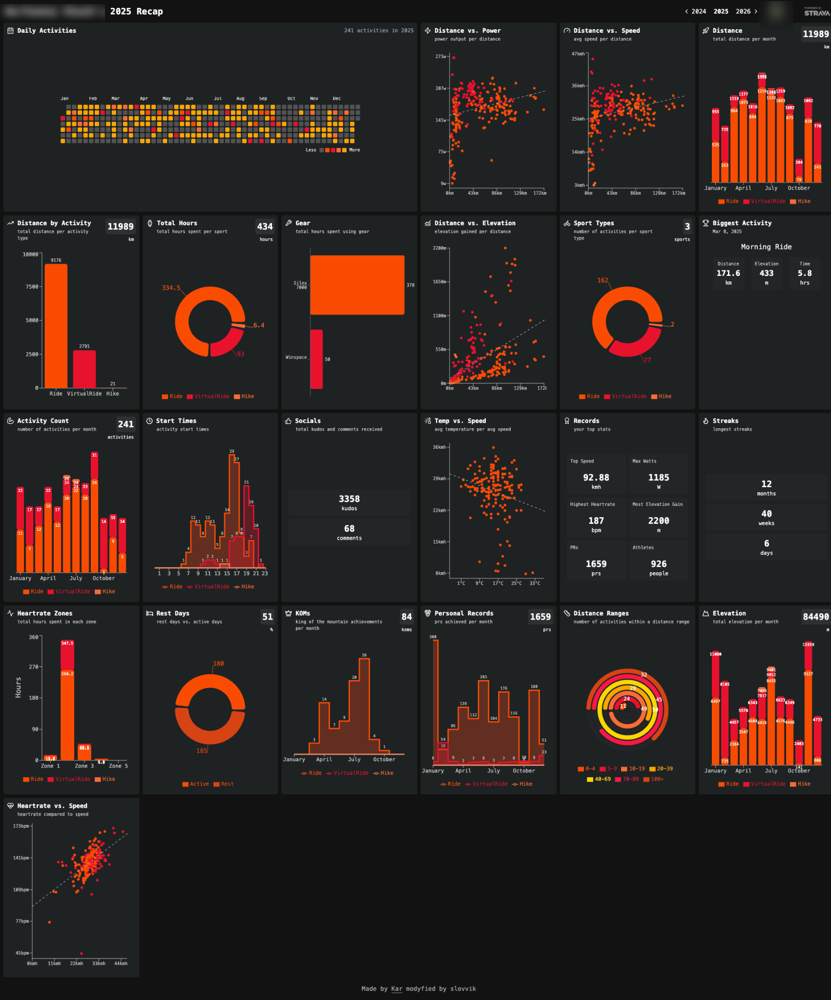

# Strava Fitness Recap



## Do you want to see your Strava year recap?

This app is designed to run locally because Strava has low API rate limits that make it difficult to host as a public service.

### 1. Create a Strava API Application
1. Go to [Strava API Settings](https://www.strava.com/settings/api)
2. Create a new application by filling out the form:
   - **Application Name**: Choose any name (e.g., "My Strava Recap")
   - **Category**: Choose the most appropriate category (e.g. "Visualizer)
   - **Club**: Leave blank (optional)
   - **Website**: Use `http://localhost:5173` for local development
   - **Authorization Callback Domain**: Use `localhost`
3. After creating the app, you'll see your `Client ID` and `Client Secret` - keep these handy!

### 2. Clone the Repository
```bash
git clone https://github.com/slovvik/strava-recap.git
cd strava-recap
```

### 3. Set Up Environment Variables
Create a `.env` file in the root directory and add your Strava credentials:
```txt
VITE_STRAVA_CLIENT_ID=<your strava client id>
VITE_STRAVA_CLIENT_SECRET=<your strava client secret>
VITE_STRAVA_REDIRECT_URI_DEV=http://localhost:5173
VITE_MAPBOX_ACCESS_TOKEN=<mapbox access token>      (optional)
```

### 4. Install Node.js and npm
If you don't have Node.js and npm installed:

**macOS:**
```bash
# Option 1: Using Homebrew
brew install node

# Option 2: Without Homebrew
# Download the installer from https://nodejs.org/
# Open the downloaded .pkg file and follow the installation wizard
```

**Windows:**
- Download the installer from [nodejs.org](https://nodejs.org/)
- Run the installer and follow the installation wizard

**Linux (Ubuntu/Debian):**
```bash
sudo apt update
sudo apt install nodejs npm
```

**Linux (Fedora):**
```bash
sudo dnf install nodejs npm
```

Verify installation:
```bash
node --version
npm --version
```

### 5. Install Dependencies
```bash
npm install
```

### 6. Start the Development Server
```bash
npm run dev
```

The app will open at `http://localhost:5173`. Log in with your Strava account and enjoy your year recap!
